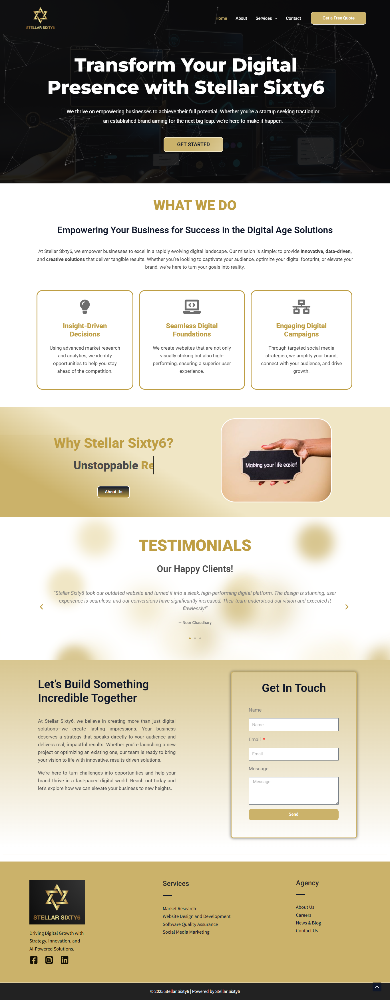

# Stellar Sixty6 – WordPress Agency Website 🚀

**Created by: Ammara | Web Designer & Automation Expert**  
*Helping Brands Grow with AI-Powered Websites & Smart Automation*

---

## 🔍 Project Overview

[Stellar Sixty6](https://stellarsixty6.com/) is my own digital marketing agency — and this website was **fully designed and developed by me using WordPress**. It showcases our core services in web development, AI automation, lead generation, and digital strategy.

The site combines bold visuals, a clear layout, and smart content architecture to drive engagement and conversions. It's optimized for both desktop and mobile and built with scalability in mind.

---

## 💼 My Role & Contributions

- Planned, designed, and developed the entire site in **WordPress**
- Customized theme layouts with a focus on UX and conversion
- Integrated lead forms, dynamic sections, and CTAs
- Optimized for speed, SEO, and responsive design
- Wrote SEO-friendly, client-focused content across all pages

---

## 🛠️ Tools & Tech Used

- **WordPress**
- **Elementor**
- Contact Form Plugins
- On-Page SEO Tools
- Responsive Layouts
- Speed Optimization Plugins (e.g., WP Fastest Cache, etc.)

---

## 📈 Key Features

- Custom-designed **Homepage, Services, and Contact pages**
- Clear service structure for website, automation, and marketing
- Integrated lead forms and newsletter
- Mobile-optimized layout
- Strong visual branding and messaging

---

## 🖼️ Website Preview

### Homepage

---

## 🔗 Live Website

👉 [Visit Live Site](https://stellarsixty6.com)

---

> 💬 *This project represents the heart of my business — a fully custom WordPress website that blends strategy, design, and automation to help brands grow online.*

